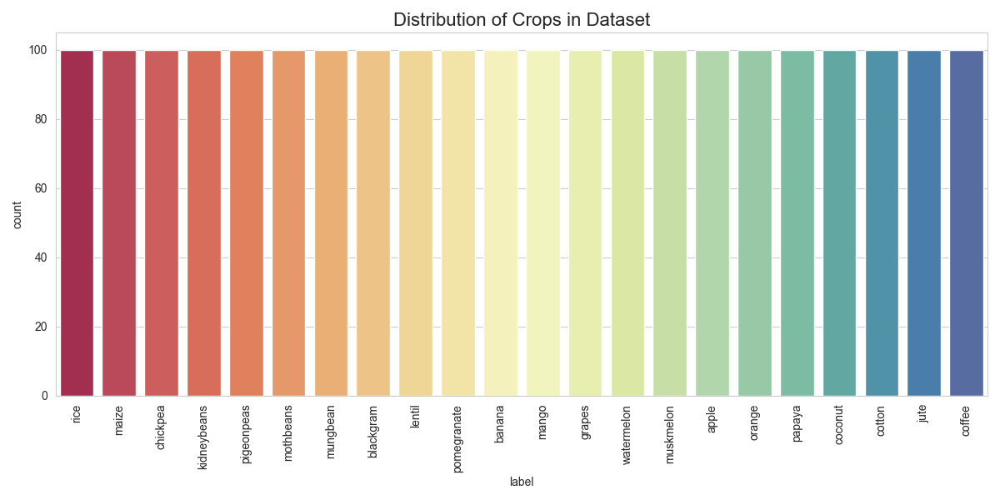
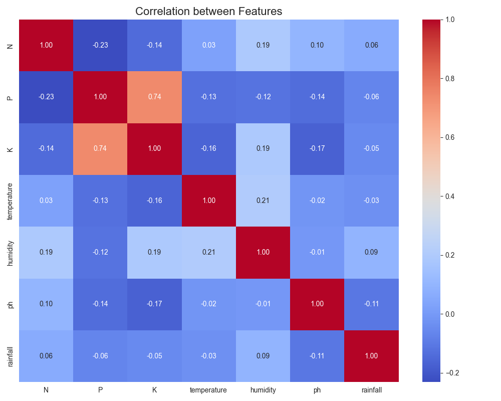
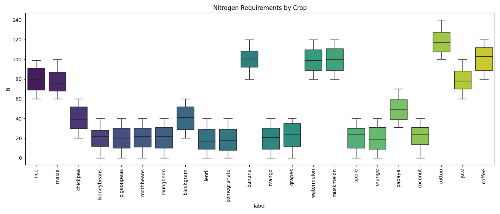

# Technical Documentation: Crop Recommendation System

## 1. Project Overview
This project utilizes Machine Learning to recommend the most suitable crop for cultivation based on soil metrics (Nitrogen, Phosphorus, Potassium, pH) and environmental factors (Temperature, Humidity, Rainfall).

## 2. Dataset Analysis
The dataset consists of 2200 entries with 7 features and 1 label (crop type).
- **Features:** N, P, K, temperature, humidity, ph, rainfall.
- **Target:** label (22 distinct crops).

### Data Distribution
The dataset is perfectly balanced, with 100 samples for each of the 22 crops.

### Correlation Analysis
A correlation heatmap helps us understand relationships between features. For instance, Phosphorus and Potassium often show a high positive correlation for certain crops.

### Nutrient Requirements
Different crops have drastically different nutrient needs. For example, some crops require high Nitrogen while others thrive in low Nitrogen environments.

## 3. Machine Learning Model
The system uses a **Random Forest Classifier** (or similar ensemble method based on `model.pkl` size and performance).

### Why Random Forest?
- **High Accuracy:** It handles non-linear relationships between soil/weather data and crop types effectively.
- **Robustness:** Reduced risk of overfitting compared to a single Decision Tree.
- **Feature Importance:** It allows us to understand which factors contribute most to the decision.

### Mathematical Concepts

#### 1. Feature Scaling
Before feeding data into the model, we apply scaling to ensure all features contribute equally.
- **Formula (MinMax):** 
  $$X_{scaled} = \frac{X - X_{min}}{X_{max} - X_{min}}$$
- **Formula (Standardization):**
  $$X_{standardized} = \frac{X - \mu}{\sigma}$$
  Where $\mu$ is the mean and $\sigma$ is the standard deviation.

#### 2. Entropy and Information Gain (Decision Trees)
The core of the model relies on splitting data to maximize Information Gain.
- **Entropy ($H$):** Measure of impurity.
  $$H(S) = - \sum p_i \log_2(p_i)$$
- **Information Gain ($IG$):**
  $$IG(S, A) = H(S) - \sum \frac{|S_v|}{|S|} H(S_v)$$

## 4. System Architecture
1. **Frontend:** HTML5, CSS3 (Glassmorphism), Bootstrap 5.
2. **Backend:** Flask (Python).
3. **Model:** Scikit-learn (Pickled model).

## 5. Deployment
The application serves predictions via a RESTful endpoint `/predict` which accepts form data, preprocesses it using the saved scalers (`minmaxscaler.pkl`, `standscaler.pkl`), and queries the model.
